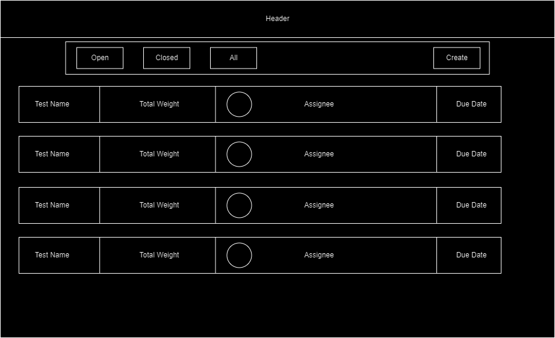
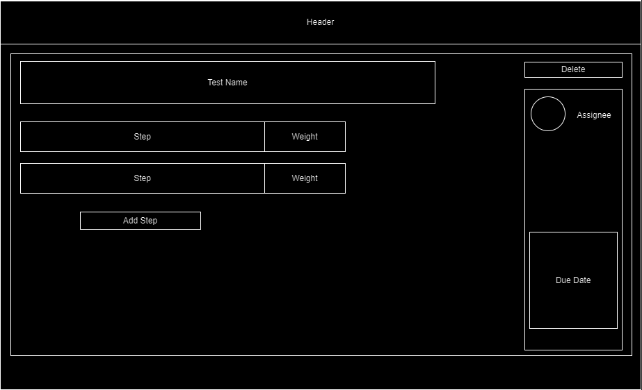
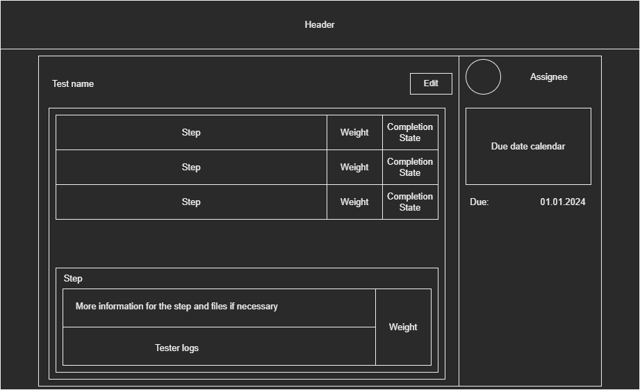
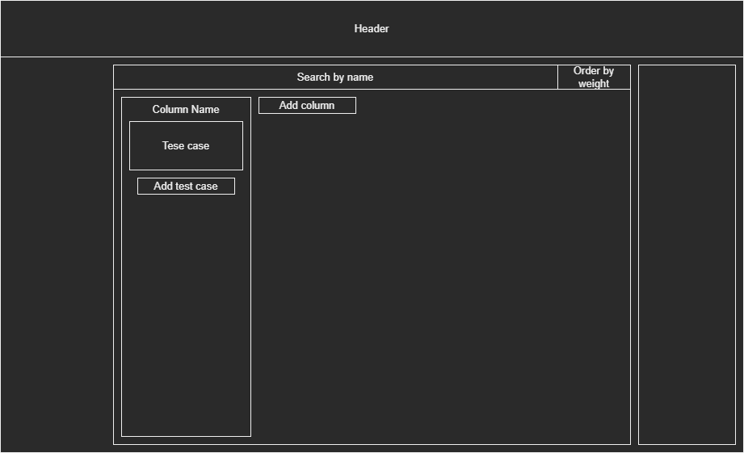
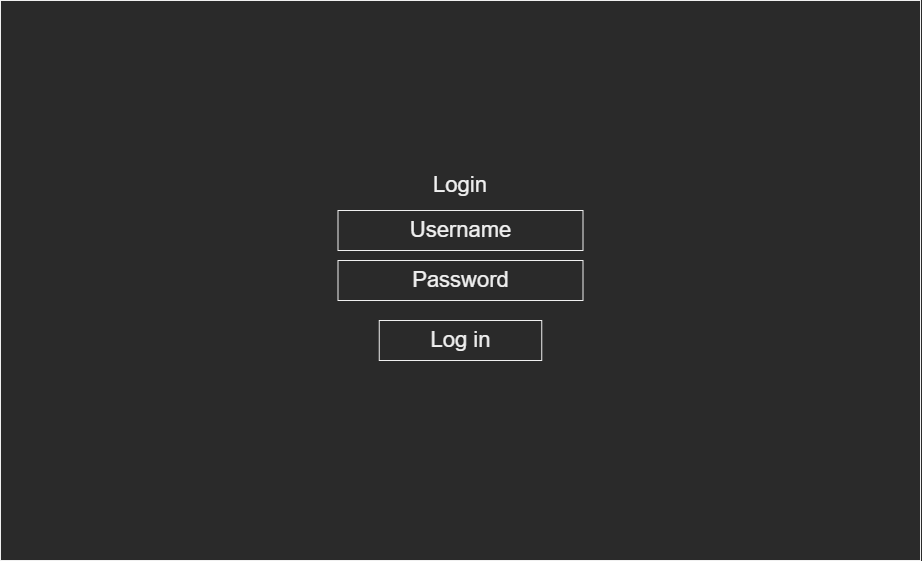

# Client Communication Log

## Sprint 0
First communication was on the 29th November when we went to the company.
They showed us a presentation, and then we asked some questions. We do not have exact questions from the meeting, but still some of the questions we asked where:

Is there a need for different roles, like admin privileges and normal ones.
Answer to that was yes.

We had a talk about our choice of technologies. Using Svelte, TypeScript and MySQL.
They said it was ok, no issues.

We asked about how to send a notification about the blocker.
They said any way that is outside our program.

We talked about what permissions should different roles have.

In the discord we asked one question to clarify if we understood the role permissions

''hello we are currently defining the functional design and we where wondering if we have the correct permissions assigned to the correct role:

Tester: change completion state, move between columns, edit description
Developer: edit tests, add tests, remove tests
Admins: reset board, delete tests, add tests, edit tests''

## Sprint 1

We received information about our question from Sprint 0

**Nick**: looks good. but why does a tester need to change te test description

**Viktor**: Yes we wrote that a bit wrong, we meant the logs where they can input information for the test they ran

**Nick**: Ok

We then sent our wireframes to get feedback.

**Viktor**: Hello, these are the wireframes we created. Wanted to shared them with you for possible feedback.
this is for the place where you can see a list of all test cases, outside of a board. 

-----------------------------------------------
This one is for creating a new test case

----------------------------------------------
This is the page which opens when you click on a test case and you can see more information about it

-----------------------------------------
This is the main screen with the board, where you can put columns and issues.

------------------------------
and a simple log in page

**Nick**: i'll take a look at them today
is this a overview of a sprint ?

what do the buttons do?

i suggest making this in a flow
all test fall into a module in the application i might be a nice idear to be able to see and groups test based on these modules.

And the due date are the same for all tests in a sprint

**Viktor**: Okay, we will change them a bit, we also got some new ideas today.

**Alex**: Good afternoon, @Nick can we schedule a meeting on next Tuesday morning, does it work for you?

**Nick**: I'll get back to you on that
can we have a meeting online, let say friday ?
or ask me some questions here

**Viktor**: Is Friday at 9:30 okay?
We would prefer a meeting to get feedback

**Nick**: I'm back.
is 10:00 ok

**Viktor**: Yes
Online here in discord?

**Nick**: Yes

During the meeting we showed them what we have so far. Nick noted that they do not want
per day test counter, which we thought of doing. Gave us an example test case to use
Gave some feedback on front end.

## Sprint 2

**Nick**: How is it going guys?

**Viktor**: We have done a bunch of work for the back end, its mostly done now. So we will be focusing on front end and connecting them now.
we have a question actually, since we are goning to send emails for notifications, we need to save the emails. But do you want log in to be with that same email? Or should we also include a username, to be used for log in?

**Randy**: Since Nick is not working today here is an answer: if there are no mayjor co ncerns I would prefer to have the email adres as username also.

**Jafar**: @Nick Happy new year,
Would it be possible to arrange a meeting either this week or next week?
Would Tuesday or Thursday be convenient for you?

**Nick**: doe you want this in person or online in teams

**Alex**: In person is preferred

**Nick**: Tuesday is ok someware.  between 11 and 16:00

**Viktor**: We agreed on Tuesday 11:15 in person