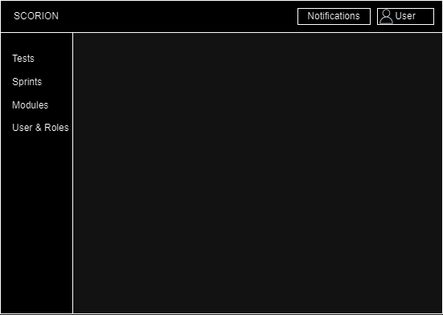
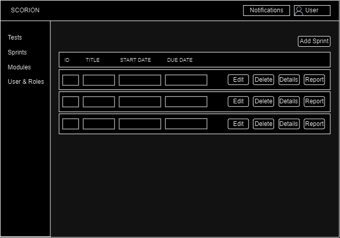
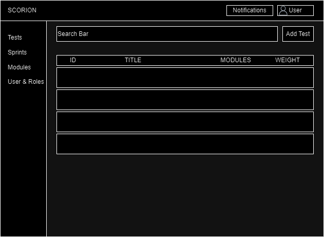
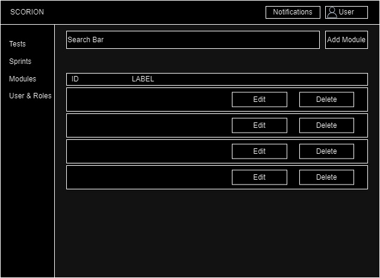

# Functional Design
`Revision: 1.2` 

# Table of Contents

- [Introduction](#introduction)
  - [Problem Statement](#problem-statement)
  - [Context Analysis](#context-analysis)
- [Solution Overview](#solution-overview)
- [Functional Specification](#functional-specification)
  - [Business Requirement](#business-requirement)
  - [User stories](#user-stories)
  - [Wireframes](#wireframes)
  - [Functional Requirements](#functional-requirements)
- [Non-Functional requirements](#non-functional-requirements)
- [Exceptional Handling](#exceptional-handling)
- [user credentials](#user-credentials)
- [Change Log](#change-log)

# Introduction

The Functional Design document outlines the necessary functionalities and requirements for our testing and management
system's development. This document is a comprehensive guide meant to benefit stakeholders, developers, and testers
involved in the project. By carefully defining requirements and incorporating wireframes, this document ensures the
meticulous planning vital for building a resilient and user-friendly system.

- `revision history:`
In first revision, we have added the requirements. In the second revision, we have added the Introduction, Problem Statement and Solution
Overview,and Exceptional handling Also, we have updated the requirements and moved the wireframes from system design to functional design.

## Problem Statement
The current regression testing process using Scrum boards in Jetbrains Space has the following problems:

* No easy way to track overall progress and generate reports
* Difficult to restart testing for new sprints
* No notifications for upcoming or overdue tests
* No immediate alerting about blocking bug discoveries
* Testing data not preserved when boards reset
 
## Context Analysis

Parantion needs to frequently conduct regression testing across multiple products. New versions are released in 
2 week sprints. Regression testing is done manually by dedicated QA testers.
A dedicated QA team executes pre-defined test cases to verify expected behavior and identify defects.
Key aspects of the testing process:

* Tests span multiple products
* New and updated test cases each sprint
* Tests assigned to individual testers
* Results logged as pass/fail/blocker
* Weighted test cases to estimate effort
* Status reports needed for progress
* Critical bugs require immediate alerts
* Reports needed for completed sprints
* Roles and permissions needed for access control
* Overviews needed for management

The current process using Scrum boards has proven insufficient as testing volume and complexity grows.

# Solution Overview

The proposed solution is a web application with the following components:

- User Management: Administrators have the capability to create and manage tester accounts along with their respective
  permissions.

- Sprint Management: Administrators possess the authority to add, edit, and close sprints, and the active sprint is
  prominently displayed on a central dashboard.

- Test Case Management: Administrators can create test cases, inclusive of details such as name, description, steps,
  weight, and assignee. These test cases are systematically organized under specific sprints.

- Test Execution: Testers can access their assigned test cases, mark individual steps as passed or failed, log bugs, and
  attach relevant files.

- Reporting: Users have the ability to generate comprehensive reports on test status and progress per sprint or product,
  incorporating metrics such as passed tests and bug counts.

- Notifications: Real-time notifications through websockets are triggered for blocking bugs, and email alerts are sent
  for overdue tests.

- Reset Board: Administrators can efficiently close a sprint and reset the board, preparing it for new test cases for
  the subsequent sprint.

- Progression Tracking: Test cases are assigned a weight, and as testers mark steps as completed, the overall progress
  is dynamically calculated.

The application will be hosted on a server and accessed through a standard web browser. User authentication ensures
that individuals can log in and utilize the application's features based on their assigned roles and permissions.
The home page serves as a Sprint Dashboard, providing a snapshot of the ongoing sprint. Admins can manage sprints and
access features such as adding or removing sprints. Access to Sprint overview, Test Case, and report generation is
available to all users. Developers share similar features with admins, excluding the User Management System.
For an overall view of test cases, a Test Case Dashboard is available. Each test case has a dedicated Test Case Page,
detailing steps with associated weights. Users can add new steps, change step statuses, attach files, edit, or delete
test steps. Test progression is monitored through assigned weights, with each test case having an estimated weight and
an assignee field. The system tracks completed tests, and individual test steps within a test case can be marked as
completed. Immediate notifications are sent to subscribed users for blocking bugs.
The application is constructed using a contemporary web framework like Svelte/Node.js, and data is stored in a
Postgres database. While the initial version prioritizes manual testing features, future iterations may incorporate
automated testing integration. Automated testing integration could be added in the future.

# Functional Specification
## Business Requirement

| Business Requirement                                                                                                            | MoSCW | Source    |
|---------------------------------------------------------------------------------------------------------------------------------|-------|-----------|
| The system must be easy to use and easy to understand so we don’t have to spend time explaining to new employees.               | M     | Interview |
| The system should be error-free so that it will not slow down our company’s progress or even damage our profit.                 | M     | Document  |
| The system should be accessible and user-friendly on mobile devices to enable users to perform essential tasks while on the go. | M     | Document  |
| The system must be ready for future growth, accommodating evolving business needs and the addition of more employees.           | M     | Interview |

## User stories

| User Stories                                                                                                                                           | MSCW | Source    |
|--------------------------------------------------------------------------------------------------------------------------------------------------------|------|-----------|
| As a tester, I want to mark tests as blockers so that I can highlight serious bugs.                                                                    | M    | Interview |
| As a developer, I want to assign weights to tests so that overall test effort can be estimated.                                                        | M    | Document  |
| As a Admin, I want new boards to set up when old ones close so that new sprints can be started seamlessly.                                             | M    | Document  |
| As a Admin, we want to add new sprint so that I can categorize test cases.                                                                             | M    | Document  |
| As a Admin, I want to set due dates for tests so that test execution has clear timelines.                                                              | M    | Document  |
| As a Admin, I want to edit user roles so that access can be controlled efficiently.                                                                    | M    | Interview |
| As a user, I want to see an overview of current tests so that I can get the big picture.                                                               | M    | Interview |
| As a user, I want to able generate report of tests per sprint so I can check situation.                                                                | M    | Document  |
| As an Admin, I want to edit added tests to fix any errors.                                                                                             | M    | Interview |
| As an Admin, I want to be able to add test cases so that we can test new features.                                                                     | M    | Document  |
| As a User, I want to search tests by names so that I can access them faster.                                                                           | M    | Document  |
| As a tester, I want to receive notification about overdue tests so that I can prioritize my work.                                                      | M    | Document  |
| As a tester, I want to receive notification about upcoming tests so that I can prepare and allocate time.                                              | M    | Document  |
| As a tester, I want to be able to assign and unassign people from test cases.                                                                          | M    | Interview |
| As a tester, I want to be able to add comments on test cases so that I can keep track of progress.                                                     | M    | Interview |
| As a tester, I want to be able to generate reports containing information about tests completed so far for this sprint and/or including older sprints. | M    | Interview |
| As a tester, I want to be able to attach files to test case logs so that we can use images and videos to be more descriptive.                          | S    | Interview |
| As a tester, I want to be able to change the status of the test case so that we can organize better.                                                   | M    | Interview |

## Wireframes

### Log in
The first wireframe is the login.
It's a simple page which contains only 4 elements. Two input fields, for the username and for the password. A button which will log in the user if the input is correct.

### Navegation

Navigation Bar: On the left side, there’s a vertical navigation bar. Below it are four menu items: Tests, Sprints, Modules, User & Roles. These likely represent different sections of the application that users can navigate to.
Main Area: The main area of the interface will displays information of each menu item.
Top Right Corner: At the top right corner, there are icons for Notifications and User profile/settings.

### List All Sprints
Main Area: The main area of the interface displays a table for tracking sprints. The table has columns for ID, Title, Start Date, and Due Date. Each row in the table represents a sprint and has options to Edit, Delete, view Details or generate a Report. This suggests that users can manage sprints directly from this interface.
Top Right Corner: At the top right corner, there’s also an “Add Sprint” button next to them. Which likely allows users to create new sprints.

### List All Tests
Main Area: The main area of the interface displays a table for tracking tests. The table has columns for ID, Title, Modules, and Weight. Each row in the table represents a test and has options to Edit, Delete, view Details or generate a Report. This suggests that users can manage tests directly from this interface.
At the top right corner, there is an “Add Test” button next to them, which likely allows users to create new tests.

### List All Modules

It contains the board that will contain the columns, which will contain the test cases. On the top of it is a search bar where you can type name of test cases to search. On the right of, there is a button to order by weight, if disabled will be ordered by user movement choice.

On the left side there is already a column added. It has a name, which is visible on the top. Inside the column are test cases, in this example there is 1, it will only show its name, for more information you have to click on it. Below all test cases in the column, a button will be shown. It will allow the user to create a new test case.

Newly crated columns will go next to each other, and the screen will be sideways scrollable. Newly added test cases will go on the added column at the bottom.

### Test case page
The third wireframe is the page which you see when you click on an issue.

This page contains quite a few things. On the top left it will say the test case name. Below that will be a place where each step, that needs to be done to execute the test. There can be multiple steps, if there are more than the screen can contain, it will turn into a scrollable screen. To edit the test case press the edit button. The steps contain information about what needs to be done, the weight and whether they are completed or not. When a step is pressed, more information about it will appear below the steps. There is also a field where the tester can enter information about their tests if they decide they need to.

On the right side you can see the assigned person and the due date.

### List of All Test Cases
The fourth wireframe is the page that shows the list of test cases

This page contains a few things. On the top middle the test cases can be filtered by open, close and all. Next to filters a new test case can be created.

The list of the test cases shows test name, total weight of the test case, assignee and the due date. To see the details of the test case just needed to click on it.

### Create Test Issue
The fifth wireframe represents the page of that test issue can be created.

This page is the first page of creating a new test issue. On top left it asks the test name. The button on top right deletes the whole test issue, if its created by mistake. Below of the delete button, with assignee button test can be assigned to a person and can be put the due date of the test issue. On middle left it asks the steps and weights. Steps can be added one by one with Add Step button.

## Functional Requirements

| Functional Requirements                                                                                                                                                                     | MSCW | Source              |
|---------------------------------------------------------------------------------------------------------------------------------------------------------------------------------------------|------|---------------------|
| The system must notify testers about tests that have passed their due date.                                                                                                                 | M    | Document            |
| The system must notify testers about tests that are due soon.                                                                                                                               | M    | Document            |
| The system must immediately send a notification upon detecting a blocking issue.                                                                                                            | M    | Interview           |
| The system must allow sorting tests by weight per column.                                                                                                                                   | S    | Document            |
| The system must generate reports on the completion status of regression test runs per sprint and product, including details on tests, testers, failed/passed tests, time taken, and weight. | S    | Interview           |
| The system must save data when a board is closed to be included in reports later.                                                                                                           | M    | Document, Interview |
| Access to test data and configurations should be role-based, ensuring that users only have access to information relevant to their roles.                                                   | M    | Document, Interview |
| The system must allow searching of tests by name.                                                                                                                                           | S    | Document            |

# Non-Functional requirements

| Non-Functional requirements                                                                                                                                                                                      | MSCW | Source              |
|------------------------------------------------------------------------------------------------------------------------------------------------------------------------------------------------------------------|------|---------------------|
| The system must ensure the confidentiality, integrity, and availability of all data and transactions. It must comply with GDPR legislation and prevent unauthorized access, modification, or disclosure of data. | M    | Document            |
| The system should be designed to accommodate the company's future growth in terms of features, functionalities, and data storage capacity.                                                                       | M    | Document            |
| The system must be able to integrate with other systems or platforms used by the company, such as accounting and inventory management systems.                                                                   | M    | Interview           |
| The system must be easy to use and navigate for all employees, regardless of their technical skill level. It must have a user-friendly interface with clear and concise instructions.                            | M    | Interview           |
| The system should be available 96.67% of the time.                                                                                                                                                               | M    | Document            |
| The system must be compatible with different web browsers, operating systems, and devices, such as desktops, laptops, tablets, and mobile phones.                                                                | M    | Interview, Document |
| The system must be able to recover from failure within 10 minutes without data loss or disruption of service.                                                                                                    | M    | Interview           |
| The system should be easily maintainable, allowing updates and bug fixes to be implemented without causing downtime or loss of data.                                                                             | M    | Interview           |

# Exceptional Handling

# User Credentials

Credentials that can be used to log into the system to use it.

| Username    | Password | Account type |
|-------------|----------|--------------|
| `admin`     | admin    | admin |   
| `tester`    | tester   | tester|
| `developer` | developer     | developer|

# Change Log
- V 1.1
Added requirements
- V 1.2
Added Introduction, Problem Statement and Solution Overview, and Exceptional handling Also, we have updated the
requirements and moved the wireframes from system design to functional design.
