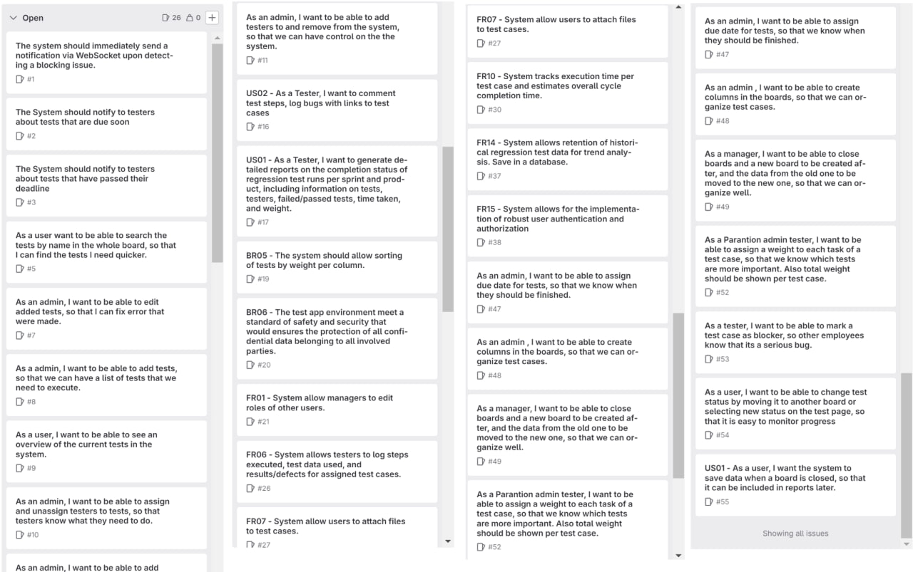
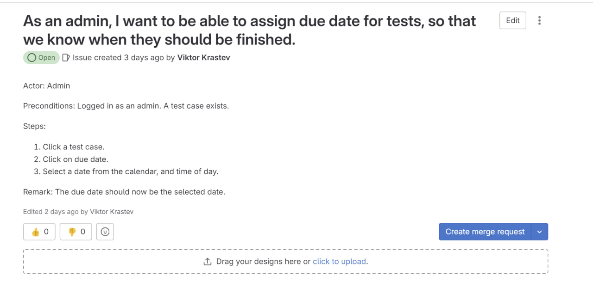
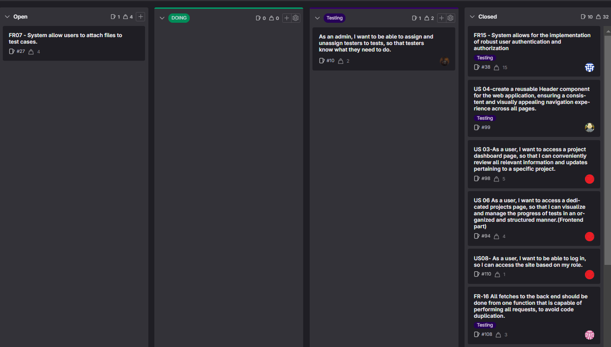
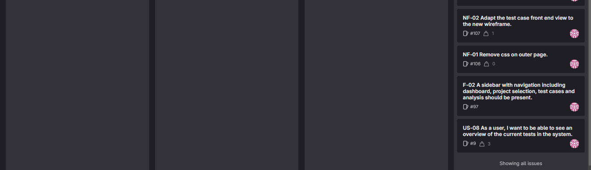
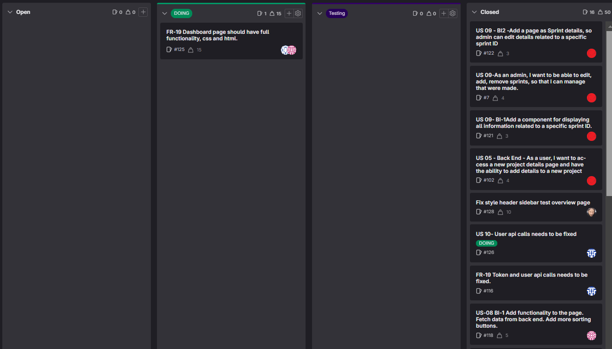
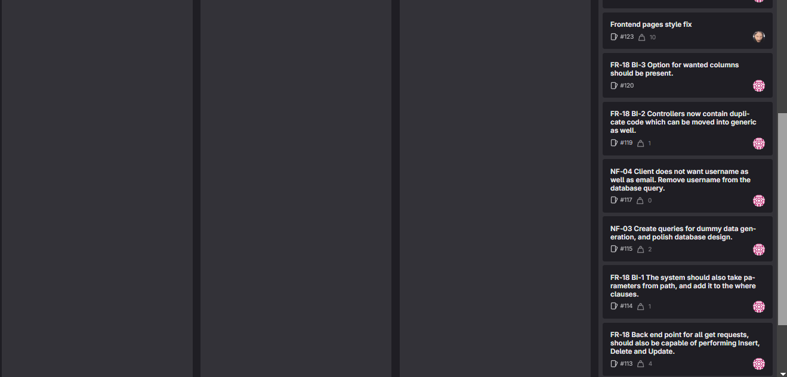
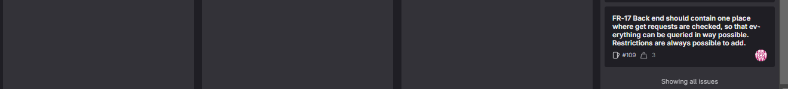

# SCRUM DOCUMENTATION
# Startup  - Scrum Master - Jafar
In Startup stage, our primary focus was on establishing the groundwork for our Scrum Documentation. Our goal was to
organize the team effectively, analyze project assignments thoroughly, and ultimately produce a validated functional 
design and basic architecture. This stage serves as the project's foundational cornerstone, setting the tone for 
organized collaboration and providing a clear roadmap for subsequent sprints. As we this initial phase, our commitment 
to meticulous planning and a well-defined structure reflects our dedication to ensuring the success of the entire Scrum
process.

## Backlog
[Backlog images related to startup stages]
Board with all issues

Every issue has user story related to it in the description

## Sprint 0

### Meeting 1 - 21.11.2023 9:30
Scrum Master - Jafar

In this meeting the assignment description was analyzed.

Present:
Jafar
Viktor
Justin
Ruben
Aleks
Yaroslav
Ferhat

Absent:

### Meeting 2 - 23.11.2023 15:00
Scrum Master - Jafar

In this meeting, we discussed what should be included in the startup stage. A document structure was also created.
Each member wrote part of the PoA and requirements.

Present:
Jafar
Viktor
Justin
Ruben
Aleks
Ferhat

Absent:
Yaroslav, sick

### Meeting 3 - 24.11.2023 20:00
Scrum Master - Jafar

In this meeting, we discussed functional design and its items, as well as assigned tasks to team members.
This meeting was held via Discord on Friday.

Present:
Jafar
Viktor
Yaroslav
Aleks

Absent:
Justin
Ruben
Ferhat

### Meeting 4 - 28.11.2023 9:00
Scrum Master - Viktor

This was the meeting with the client, we went to Parantion and talked with the client. We asked some of our questions and got a clearer idea of what we have to deliver.

Present: 
Viktor
Justin
Ruben
Yaroslav
Aleks
Ferhat

Absent:
Jafar, sick

### Meeting 5 - 29.11.2023 14:10 
Scrum Master - Viktor

In this meeting, we looked over the issues after the meeting with the client and filtered the board, edited, removed and
added missing ones. We also talked about the tasks we will do after this meeting.

Present:
Jafar
Viktor
Justin
Ruben
Yaroslav
Aleks

Absent:
Ferhat, working

### Meeting 6 - 30.11.2023 9:45
Scrum Master - Viktor

In this meeting, discussed what we did on the tasks that we assigned to each other and what else needs to be done. We 
then worked on completing the business, user, functional and non-functional requirements.

Present:
Jafar
Viktor, late 40 minutes
Justin
Aleks
Yaroslav
Ferhat, late 1 hour 30 minutes

Absent:
Ruben, had other class at the same time

### Meeting 7 - 2.12.2023 15:00
Scrum Master - Viktor

In this meeting, we finalized the documentation that needs to be sent for the deliverables.

Present:
Jafar
Viktor
Aleks
Ruben
Yaroslav

Absent:
Justin, at work
Ferhat

## End of sprint 0

## Retrospectives

### Jafar

During the initial phase of our startup, I took on the role of the scrum master in the first week. This involved 
creating the initial project structure, setting up requirement issues, and initiating key Scrum documentation such as
parts of the team plan, PoA, and DoD. As the organizer and facilitator of team meetings, I ensured that our discussions
were focused on meeting project requirements and maintaining project timelines.
In addition to my managerial responsibilities, I actively contributed to the project's technical aspects. This included 
working on the functional design and playing a pivotal role in the creation of the PoA and requirements. Throughout the
sprint, I gained insights into the documentation and the necessity
for clear and concise requirements from the project's inception. Moving forward, I recognize the importance of fostering
early and continuous communication among team members to enhance collaboration and overall efficiency. 
The positive outcomes achieved during this sprint, notably the completion of documentation and the establishment of a
template code structure, stand as motivating milestones for our team as we transition into the next phase of our project.

### Viktor

During start up stage, Sprint 0, the group started doing the documentation required to lay 
the foundations for the project. I personally made about 10-15 requirements, which I 
added to gitlab. Worked on the PoA file. In the second week I read through all 
requirements that the group had made and noted which ones are bad, good, 
duplicates and any other note I had about them. On the second meeting I talked 
with the group about the notes I made and we cleaned the requirements. In our 
meeting on saturday where we finalized the documentation, I made the technical 
design and added more information about the meetings.

### Aleks

During Sprint 1, I focused on enhancing requirements, overseeing our GitLab repository, and assisting in creating documentation. While my teammates didn't specifically mention it in their retrospectives, I personally acknowledged the importance of communication for successful collaboration. The obstacles we encountered, like conflicting schedules and gaps in communication, have encouraged me to be more adaptable, proactively organize meetings, and actively engage in the upcoming stages. The favorable results we achieved, such as finished documentation and a well-organized codebase, inspire me to continually strive for improvement in the next sprint.

### Yaroslav

At the start of this project, I was working on our project documentation. I build several diagrams
for our frontend pages, also added functional and non-functional requirements. I was not present on our first class, as
I got a flu, but still I worked actively during this sprint. During our meetings I explained that we had a
misunderstanding in our requirements and functional design, which lead whole team to study materials about requirements
and then we built them correctly.

### Justin

At the project's start, I worked on documents, like the code of conduct, and tweaked some requirements. In this sprint, I took on designing the database, which you can find in the functional design. It was tricky because everyone had different ideas.

A challenge we faced was communication issues due to different schedules. Personally, I prefer not to work evenings to spend time with family and friends. Unfortunately, this meant missing some Saturday meetings, as I'm committed to work that day.

To improve, I'll be more flexible and plan sessions proactively to ensure I can participate.
### Rubén
[]
### Ferhat
I've been a bit busy with my work and other meetings that in the first two weeks. I tried my best to attend all
the classes and meetings. So far, our focus has been on the documentation and designs. I've created wireframes and
added them to Technical Document, explaining the functionality they provide to the user. Additionally, I've included business
requirements in the functional design documentation. We've also discussed the project's boundaries and risks, and I've
documented those in the Plan of Approach. Moving forward, I plan to maintain a balance between work and meetings to enhance
my productivity for the team, ensuring active participation in our upcoming meetings.

## Sprint 1

### Meeting 8 - 5.12.2023

During this meeting we discussed our progress and problems that each member encountered during the work.
Main problem was that we all focused on creating basic frontend for all the pages we have planned. As a result, big
components were created that were only suitable for one specific page and could not be used for other pages, which
lead to lots of code duplications. For backend, we kept working on the database and built some starting routers for
the server. We were only about to switch to basic js instead of typescript, so some system files and js files
which had typescript code should be changed in the backend.

Present:
Jafar
Justin (Scrum master)
Ferhat
Viktor
Aleks
Ruben
Yaroslav

Absent:
Justin

### Meeting 9 - 7.12.2023

At this meeting some of our members shared that they have problems using bootstrap library for frontend styling. So
we grouped up and helped each other to understand some basic principles of bootstrap. It made code with bootstrap
readable for everyone and we moved on splitting our tasks. About three main pages were ready, and we had to finalize
database design to know if we were missing something.

Present:
Jafar
Justin (Scrum master)
Ferhat
Viktor
Aleks
Ruben
Yaroslav

### Meeting 10 - 12.12.2023 9:30

In this meeting, discussed what we did on the tasks that we assigned to each other and what else needs to be done. We
then worked on the main page and also with database.

We will use status to change issues from one column to another one.
We decided to split our work in each page. I mean that 2 of us will 
work in the same page(one doing frontend, another one doing backend).

Present:
Ruben(Scrum Master)
Jafar
Viktor
Justin
Aleks
Yaroslav
Ferhat

### Meeting 11 - 14.12.2023 10:00

In this meeting, discussed what we did on the tasks that we assigned to each other and what else needs to be done. 
We then worked on the main page.
The database has been created, and from here we can work with the backend and see results.
Each member of the group has an assigned task, so we have to keep working

Present:
Ruben(Scrum Master)
Jafar
Viktor
Justin
Aleks
Yaroslav
Ferhat

## End of sprint 1
Board at the End Of Sprint

## Sprint 2

### Meeting 12 - 19.12.2023 10:00

During meeting 12 we discussed front and back end implementations that we have achieved. Viktor generified work
for requests for backend and frontend. We still saw that this generic solution has to be improved to be used with ease.
We progressed with test overview, sprint overview, and test edit pages on frontend. For backend we had some issues
with the database, so we decided to fix it and keep working on database controllers.

Present:
Ruben
Jafar
Viktor
Justin
Aleks
Yaroslav(Scrum Master)
Ferhat

### Meeting 13 - 21.12.2023 16:00

Generic functions were improved, so it was possible to use them for controllers in the backend. Our team had troubles
with frontend pages design, as each page had its own style. We had to work on creating similar design for all pages, 
so that style would not be that different. We started building nice controllers/routers for backend and
frontend, using generic functionality for fetch requests. We split tasks to be done for holidays.

Present:
Ruben
Jafar
Viktor
Justin
Aleks
Yaroslav(Scrum Master)
Ferhat

### Meeting 14 - 09.01.2024 16:00

This was our first meeting after holidays. We analysed what has been done. Frontend design was more shared between the
pages, there were still a lot of work to do to make it look better and make it more user-friendly. For backend, most
parts were done, some members had issues with the database queries, so we fixed them together. We decided to focus
on optimizing our code further.

Present:
Ruben
Jafar
Viktor
Justin
Aleks(Scrum Master)
Yaroslav
Ferhat

### Meeting 15 - 11.01.2024 16:00

In our 15th meeting, we continued making significant progress on both the front-end and the remaining backend tasks. 
The changes made during the holiday period were reviewed, and the team acknowledged the improvements in frontend design with a more cohesive and shared style across pages.
However, it was noted that there was still work to be done to enhance the overall user-friendliness and appearance.

Present:
Ruben
Jafar
Viktor
Justin
Aleks(Scrum Master)
Yaroslav
Ferhat

## End of sprint 2
Board at the End Of Sprint

