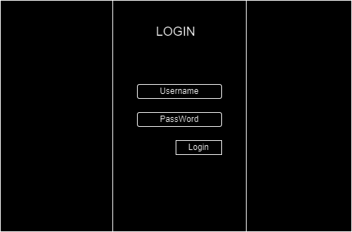

# System Design
`Revision: 1.2`

# Table of Contents
- [Introduction](#introduction)
- [General Overview and Approach](#general-overview-and-approach)
- [Design Considerations](#design-considerations)
- [System Architecture](#system-architecture)
  - [Logical View (Functional Components)](#logical-view-functional-components)
  - [Software Architecture](#software-architecture)
  - [Security Architecture](#security-architecture)
- [System Design](#system-design)
  - [Database Design](#database-design)
  - [Software Design](#software-design)
- [Change log](#change-log)

## Introduction
In this file, it will be talked about the technical part of the project Wireframes of what the program will look like will be shown, and a description of each wireframe as well as database design explanation.

## Use Case Diagrams

The use case diagrams will show what the different roles should be able to do.

## Influence Matrix

The influence matrix takes the stakeholders and visualizes who we need to prioritize.

## Wireframes

### Log in
The first wireframe is the login.

It's a simple page which contains only 4 elements. Two input fields, for the username and for the password. A button which will log in the user if the input is correct.

### Test case board
The second wireframe is the main page.

It contains the board that will contain the columns, which will contain the test cases. On the top of it is a search bar where you can type name of test cases to search. On the right of, there is a button to order by weight, if disabled will be ordered by user movement choice.

On the left side there is already a column added. It has a name, which is visible on the top. Inside the column are test cases, in this example there is 1, it will only show its name, for more information you have to click on it. Below all test cases in the column, a button will be shown. It will allow the user to create a new test case.

Newly crated columns will go next to each other, and the screen will be sideways scrollable. Newly added test cases will go on the added column at the bottom.

### Test case page
The third wireframe is the page which you see when you click on an issue.

This page contains quite a few things. On the top left it will say the test case name. Below that will be a place where each step, that needs to be done to execute the test. There can be multiple steps, if there are more than the screen can contain, it will turn into a scrollable screen. To edit the test case press the edit button. The steps contain information about what needs to be done, the weight and whether they are completed or not. When a step is pressed, more information about it will appear below the steps. There is also a field where the tester can enter information about their tests if they decide they need to.

On the right side you can see the assigned person and the due date.

### List of All Test Cases
The fourth wireframe is the page that shows the list of test cases

This page contains a few things. On the top middle the test cases can be filtered by open, close and all. Next to filters a new test case can be created.

The list of the test cases shows test name, total weight of the test case, assignee and the due date. To see the details of the test case just needed to click on it.

### Create Test Issue
The fifth wireframe represents the page of that test issue can be created.

This page is the first page of creating a new test issue. On top left it asks the test name. The button on top right deletes the whole test issue, if its created by mistake. Below of the delete button, with assignee button test can be assigned to a person and can be put the due date of the test issue. On middle left it asks the steps and weights. Steps can be added one by one with Add Step button.

###

## Database Design

## Framework Choices

We decided to use Svelte for front end, since we had a course last quartile and have some experience with it. 
We also decided to use typescript for both front end and back end. We decided that it will be good for us, since its close to javascript, and we would like to learn it. 
For database we decided to use MySQL, no really concrete reasons why it over others. 
