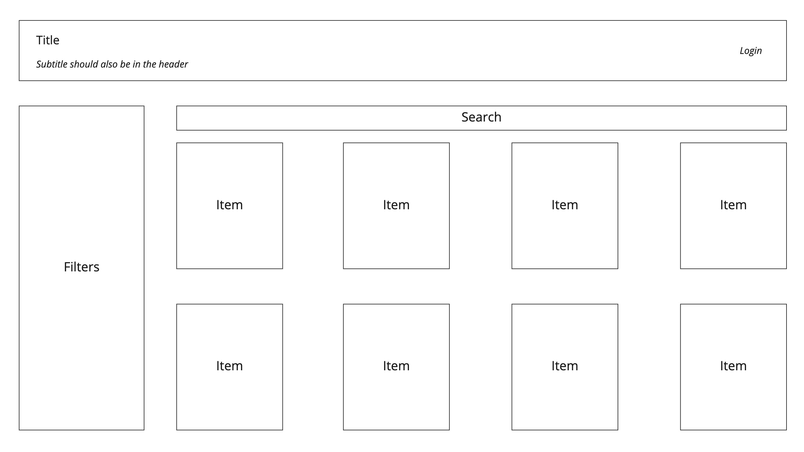
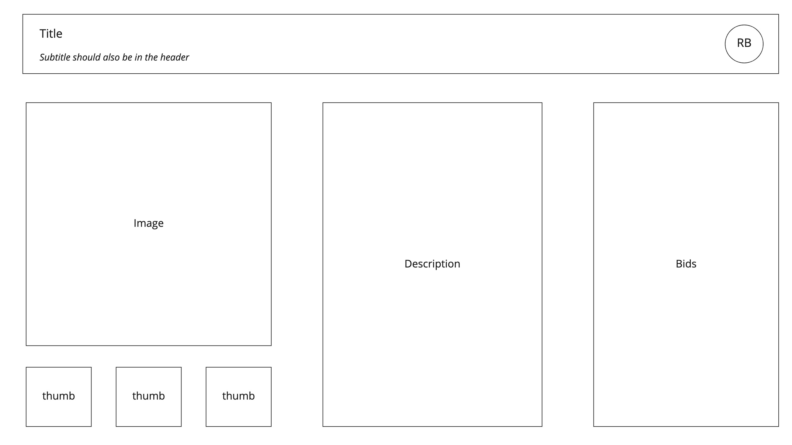
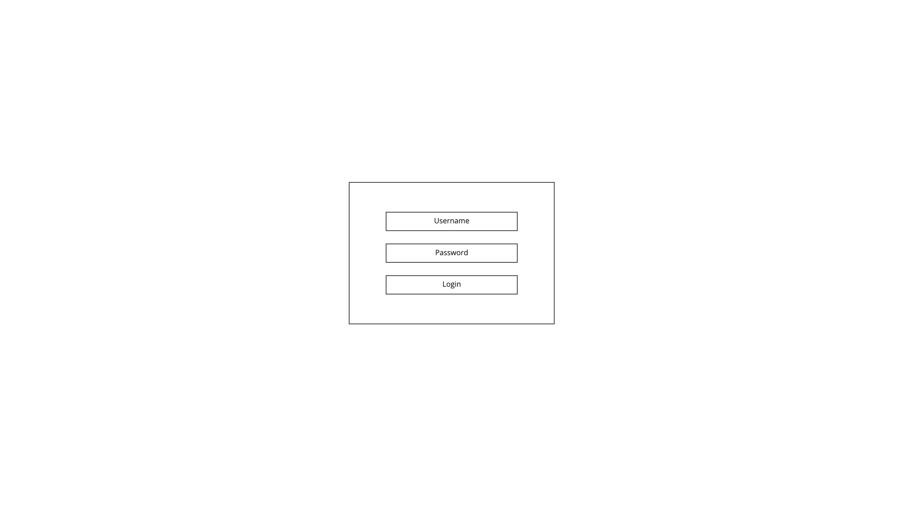
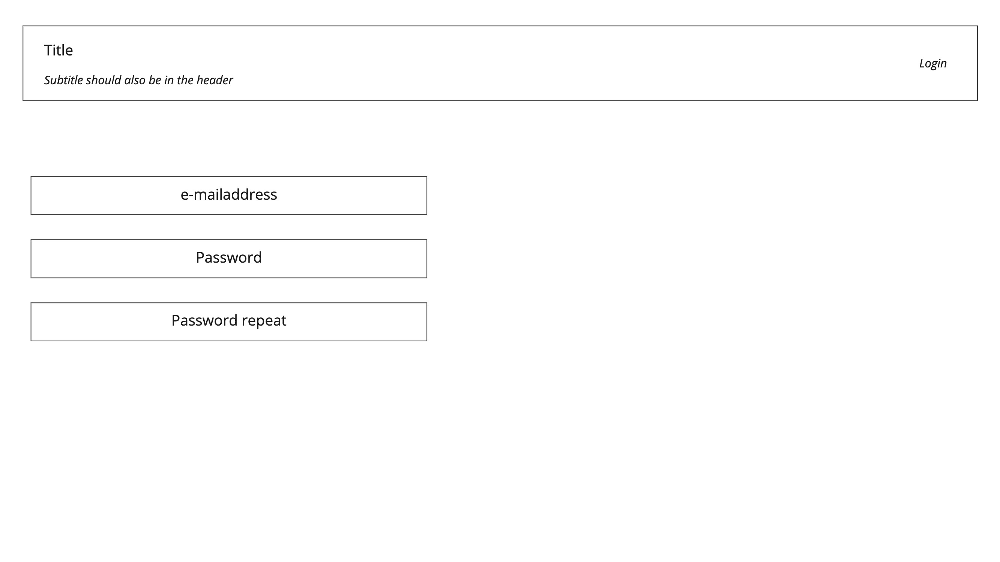

# Functional design

- [Introduction](./functional-design.md#introduction)
- [Requirements](./functional-design.md#requirements)
  - [Functional](./functional-design.md#functional)
  - [Non functional](./functional-design.md#non-functional)
- [User stories](./functional-design.md#userstories)
- [Wireframes](./functional-design.md#wireframes)

## Introduction

## Requirements

The requirements for this project have been split into functional and non-functional requirements.

### Functional

### Non functional

## Userstories

## Wireframes

Screens for managing users and items have been omitted.

### Homepage

### Details

### Login

The login page should allow the user to log in.

### Register

